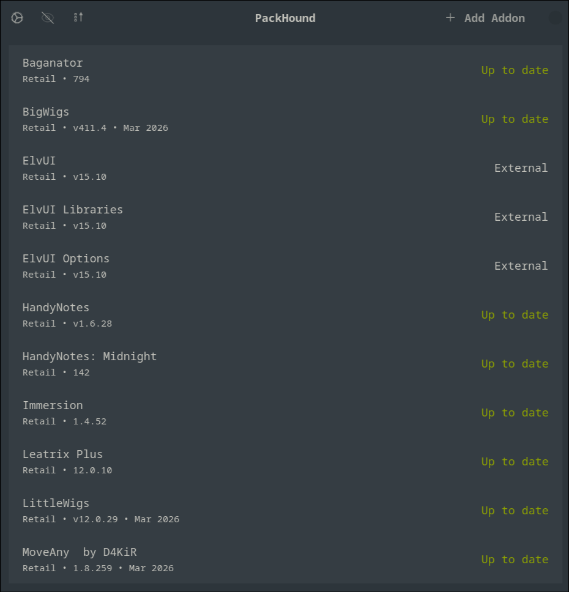
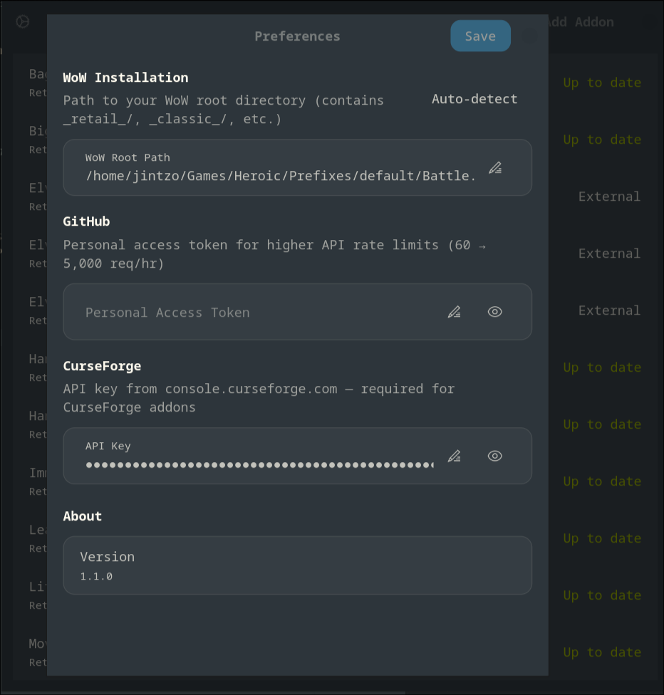

# PackHound

<p align="center">
  
</p>

A native GTK4/libadwaita GUI for managing World of Warcraft addons on Linux.
Download and update addons from GitHub releases and CurseForge — for all WoW versions.

## Screenshots

| Main Window | Preferences |
|:-----------:|:-----------:|
|  |  |

## Features

- **Install addons** from GitHub repository URLs or CurseForge URLs
- **All WoW flavors:** Retail, Classic Era, Classic (progression)
- **Automatic update checking** on launch with one-click "Update All"
- **Multi-folder addon support** — addons like BigWigs that extract multiple folders are consolidated automatically
- **Smart display names** from `.toc` files with WoW UI color/escape code stripping
- **Dependency info** parsed from `.toc` `RequiredDeps`/`Dependencies` fields
- **Release dates** from GitHub, shown per addon
- **Asset picker** — when multiple zip assets match a release, choose the right one
- **Right-click context menus:**
  - Open addon's source page in browser
  - Change source URL
  - Mark as externally tracked (managed by another app)
  - Remove from list
  - Track untracked addons
- **Sort & filter** — sort by name or update status; toggle to hide externally tracked addons
- **Auto-detection** of Wine, Lutris, Bottles, and Heroic Game Launcher WoW installations
- **Manual path configuration** with per-flavor overrides

## Install (AppImage)

Download the latest `PackHound-*-x86_64.AppImage` from the
[Releases](https://github.com/Jintso/PackHound/releases) page, move it
somewhere permanent, and make it executable:

```sh
mkdir -p ~/Applications
mv PackHound-*-x86_64.AppImage ~/Applications/
chmod +x ~/Applications/PackHound-*-x86_64.AppImage
```

### Desktop entry

To add PackHound to your application launcher, create a `.desktop` file:

```sh
cat > ~/.local/share/applications/com.github.packhound.desktop << 'EOF'
[Desktop Entry]
Name=PackHound
Comment=World of Warcraft addon manager for Linux
Exec=sh -c 'exec ~/Applications/PackHound-*-x86_64.AppImage'
Icon=packhound
Terminal=false
Type=Application
Categories=Game;Utility;
EOF
```

### Runtime dependencies

The AppImage requires GTK4 and libadwaita on your system:

| Distro | Install command |
|--------|----------------|
| Arch / CachyOS | `sudo pacman -S gtk4 libadwaita` |
| Fedora | `sudo dnf install gtk4 libadwaita` |
| Ubuntu / Debian (23.10+) | `sudo apt install libgtk-4-1 libadwaita-1-0` |

## Build from source

### Requirements

- Rust (stable toolchain)
- GTK4 ≥ 4.12
- libadwaita ≥ 1.4
- `pkg-config`

On Arch/CachyOS: `sudo pacman -S gtk4 libadwaita pkgconf`

### Build & Run

```sh
cargo build --release
./target/release/packhound
```

### Install manually

```sh
cargo build --release

install -Dm755 target/release/packhound ~/.local/bin/packhound

install -Dm644 com.github.packhound.desktop \
    ~/.local/share/applications/com.github.packhound.desktop
```

## Configuration

Config is stored in `~/.config/packhound/`:
- `config.toml` — WoW root path, optional GitHub token, and CurseForge API key
- `addons.json` — installed addon registry

Open **Preferences** (⚙) to set your WoW installation path, a GitHub
personal access token (increases API rate limit from 60 to 5,000 req/hr),
or your CurseForge API key.

## WoW Installation Path

Point PackHound at your WoW root directory — the one that contains
`_retail_/`, `_classic_/`, `_classic_era_/` subdirectories. Common locations:

| Setup | Typical path |
|-------|-------------|
| Lutris | `~/Games/world-of-warcraft/drive_c/Program Files (x86)/World of Warcraft` |
| Heroic | `~/Games/Heroic/Prefixes/default/Battle.net/drive_c/Program Files (x86)/World of Warcraft` |
| Plain Wine | `~/.wine/drive_c/Program Files (x86)/World of Warcraft` |
| Bottles | `~/.local/share/bottles/bottles/World of Warcraft/drive_c/Program Files (x86)/World of Warcraft` |

Use **Auto-detect** in Preferences to try common paths automatically.

## License

This project is licensed under the [GNU General Public License v3.0](LICENSE).
